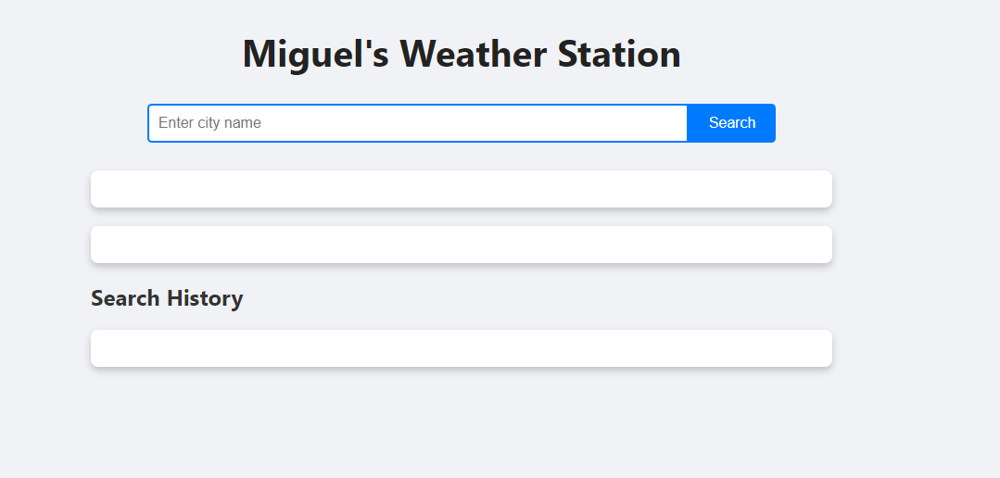
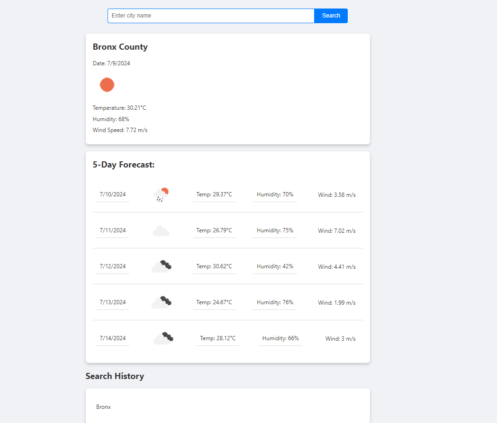

# Miguel-weather-station

## Description

This dashboard is a web application designed for travelers to check the weather outlook for multiple cities. The application provides both current and future weather conditions to help users plan their trips accordingly.

## Instalation

1. Clone the repository: 
'''sh 
git clone git@github.com:MiguelPena0101/Miguel-weather-station.git

2. Navigate to the directory

3. Open 'index.html' in your web browser

## Usage

1. Enter the name of a city in the search input and click the search button.

2. View the current weather conditions and the 5-day forecast for the searched city.

3. Click on any city in the recent searches list to view its weather conditions again.

# Resources and Articles

* [OpenWeatherMap API Documentation](https://openweathermap.org/api)
    
* [MDN Web Docs - Fetch API](https://developer.mozilla.org/en-US/docs/Web/API/Fetch_API)
    
* [JavaScript Event Listeners](https://developer.mozilla.org/en-US/docs/Web/API/EventListener)
    
* [JavaScript Promises](https://developer.mozilla.org/en-US/docs/Web/JavaScript/Reference/Global_Objects/Promise)
    
* [CSS Flexbox Guide](https://css-tricks.com/snippets/css/a-guide-to-flexbox/)

## Acknowledgements

- Thanks to OpenWeatherMap for providing the weather data API. 
- Special thanks to all the contributors of MDN Web Docs for their extensive documentation and tutorials.

- Our teacher in the BootCamp Michael F. and TA Teddy